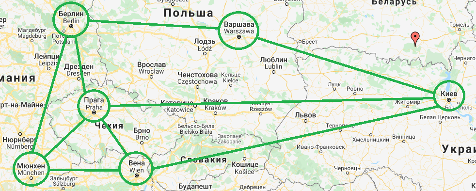

# SuperTrip - сервис по подбору маршрутов
## Дипломная работа, 2021г

### Сервис подбирает лучшие маршруты от точки А в точку Б (самый быстрый, самый дешевый и еще до двух оптимальных)
### Подбор происходит на основании расписания (на данный момент задано статически)
### Сервис использует модифицированные алгоритмы Дейкстры и А*

Работа сервиса продемонстрирована на тестовом графе:

Пример работы:

Также реализован функционал:
##### регистрация
##### программа лояльности
##### поиск уже купленных билетов
##### просмотр всего расписания для менеджеров

#### Для запуска:
1) Создать БД **supertrip**, указать логин и пароль к БД как
 ***spring.datasource.username*** и ***spring.datasource.password*** сответственно.
 Указать можно как в файле **application.properties**, так и в параметрах запуска приложения

2) Указать порт для запуска в **application.properties** (по умолчанию 8080)

3) Запустить **SuperTripApplication.java**